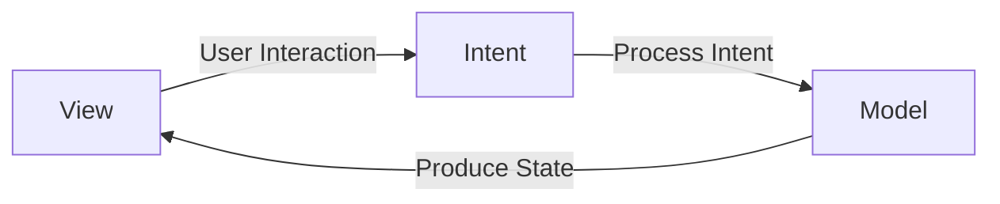
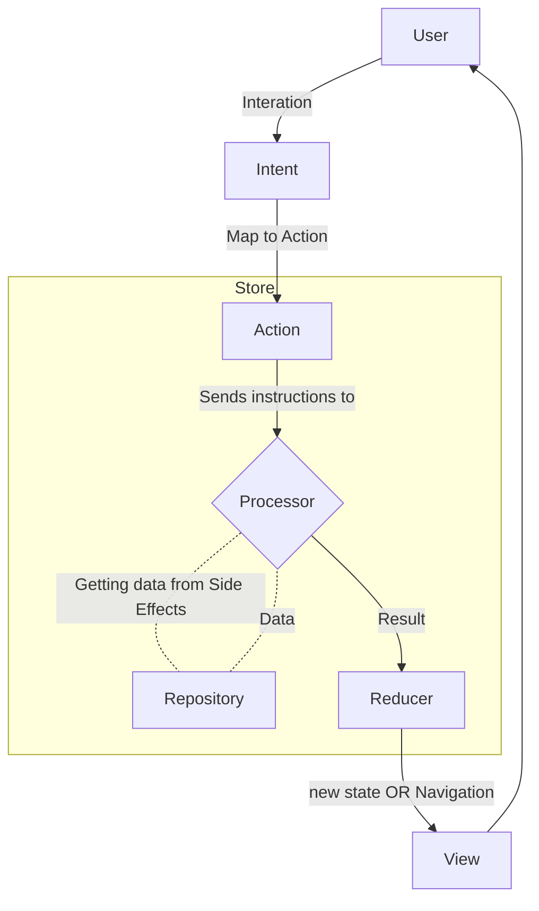

# TaskHub

I created this project as a sample to explore the **MVI (Model-View-Intent) architecture** in SwiftUI.  
The project demonstrates how to structure an app with **unidirectional data flow**, using **Model**, **View**, and **Intent** to manage state and user actions.  

It serves as a practical example for understanding how **state changes**, **user intents**, and **view updates** work together.

## The tech stack used in this project 🛠

## Tools
- Xcode 16.3.0
- Swift 6.1

## Usage

1. Clone the repository:

  ``` bash
    git clone https://github.com/helloItsHEssam/Taskhub.git
  ```

# MVI (Model-View-Intent)

MVI is an architecture pattern consisting of three main parts: **Model**, **View**, and **Intent**. Below is a description of each part.

## Model

The **Model** holds the UI state.  
It can fetch data from a repository, such as a network request or a database.

In the Model, the **state should be immutable** (read-only).  
This is because MVI is based on a **unidirectional data flow**.  

If the state could be changed from multiple directions, it would break the main principle of MVI.

### What is Unidirectional?

Unidirectional means that **data flows in one direction only**.  
Every action, such as a user request or a state change, must follow a single path.  

For example, if a user performs an action, it goes through **Intent** and then updates the **Model**.  
There should not be another path to change the state directly.

## View

The **View** is responsible for displaying the UI based on the current **state**.  
Whenever the state changes, the View **re-renders** automatically to reflect the new state.

Inside the View, the user can send their actions as **Intents**.  
These intents trigger the creation of a new state.

## Intent

**Intent** represents all user actions, such as pressing a button, pulling to refresh, or other interactions.  
Based on these intents, the system generates a **new state**.

# Summary of MVI (Model-View-Intent)

In the MVI architecture, we can think of the **user as a function**.  
The user generates an **Intent**, which triggers some action in the system.  

Based on this Intent, the system may create a **new state** or may not.  
The **View** then displays the UI according to the current state.

### Diagram of MVI Flow

Below is a diagram showing how the parts communicate:



## Deep Dive into MVI

User Intents are mapped to Actions that define what the system should do, regardless of the user's original intent. These Actions are sent to a Processor, which performs the core logic—such as fetching data or triggering navigation—and returns the outcome as a Result. The Result is then reduced into a new ViewState, updating properties like loading status or inserting new data. Finally, this updated ViewState is passed to the View, which re-renders accordingly.



## Store

All actions up to the reducer are part of a component called the **Store**.  
In other words, everything happens inside the Store.  

The Store itself contains multiple variables and handles all the processes needed to manage state changes.


###  Contributing 🤝

Contributions, issues, and feature requests are welcome! Feel free to fork the repository and submit a pull request with your changes.

## License

Please check [LICENSE](LICENSE) for details.